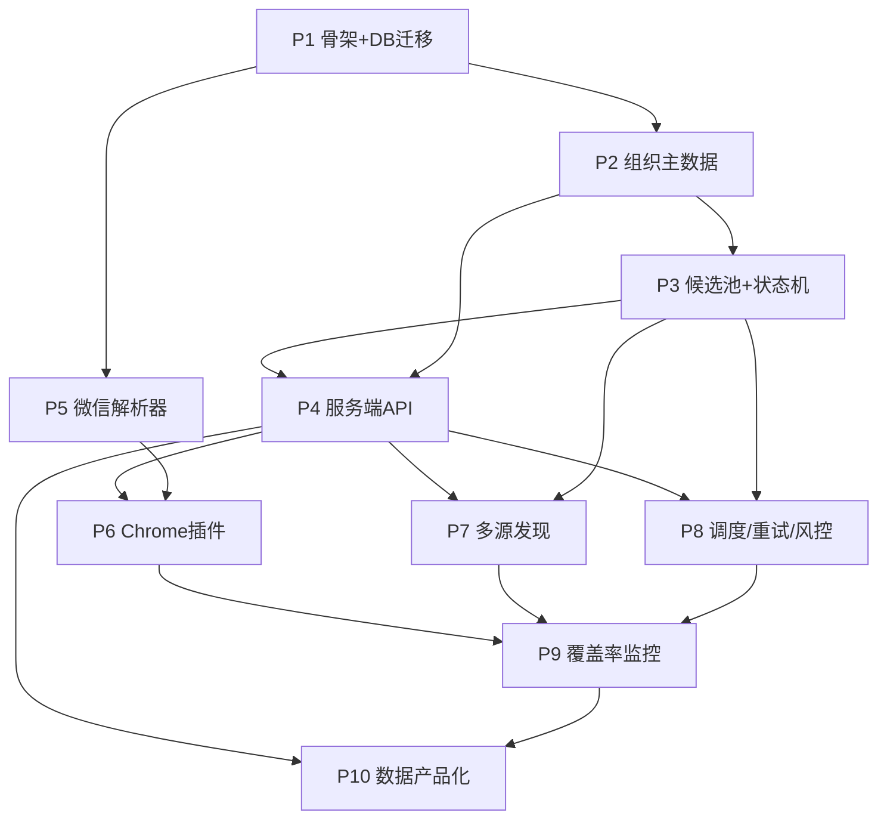

# 微信公众号 3000 家组织定向采集系统 — 主 Plan

Planned-with: claude-opus-4.8
Plan-Id: 2026-06-25-wechat-org-collector-master
分支: feature/wechat-org-collector
来源方案: ~/Desktop/公众号定向采集技术方案/微信公众号3000家组织定向采集技术方案.md

---

## 1. 目标与口径

把 BasicWebCrawler 从「单篇网页 → Markdown 工具」延伸为一套
**「多源发现 + 浏览器插件采集 + 服务端队列 + 去重入库 + 覆盖率监控 + 人工补采」** 的采集工程系统。

口径（与方案一致，写入验收标准）：
- 不承诺 100% 自动全量；目标是「高覆盖率、缺口可见、可补采、跑得久」。
- 服务端不强依赖个人微信令牌。
- 服务端负责队列/去重/存储/监控；浏览器插件负责真实浏览器环境采集公开页面。

## 2. 与现有仓库的边界（复用 vs 新建）

| 现有能力 | 复用方式 | 不复用 |
|---|---|---|
| `crawler.py` 正文提取/图片本地化/markdownify | 抽出为 `wechat` 解析器底座（`#js_content` 等配置化选择器） | 直连高频抓取 |
| Playwright 交互抓取 | 人工补采辅助 / HTML 快照回放 | 不作为规模化主链路 |
| `mcp_server/` FastMCP | 后续把采集统计/检索暴露为 MCP 工具（阶段三） | — |
| `tests/` | 沿用 pytest 结构，新增解析器回归测试 | — |

**新建（独立子系统）**：组织主数据、候选池状态机、服务端 API、Chrome 插件、多源发现、健康度监控。
新代码集中在新目录 `wechat_collector/`（Python/FastAPI）与 `extension/`（Chrome MV3），不污染现有 `crawler.py`。

## 3. 技术选型（贴近现有栈）

- 后端：Python + FastAPI（与现有 Python/FastMCP 生态一致）。
- 存储：PostgreSQL（方案已给 schema）；本地开发可用 SQLite 兜底 + Alembic 迁移。
- 队列：先用 PG 表做状态机队列（够 3000 家规模），后续可换 Redis。
- 插件：Chrome Manifest V3（content script + background + options 页）。
- 解析：复用 `crawler.py`，新增配置化 `parsers/wechat.json`。

## 4. 二级 Plan 拆分（模块 = 子 plan）

| 子 Plan | 文件 | 难度 | 阶段 |
|---|---|---|---|
| P1 项目骨架 + DB 迁移 | `2026-06-25-wc-p1-skeleton-db.plan.md` | ⭐ | 阶段一 |
| P2 组织主数据 + 导入 | `2026-06-25-wc-p2-org-master.plan.md` | ⭐ | 阶段一 |
| P3 候选池 + 状态机 + 去重 | `2026-06-25-wc-p3-candidate-pool.plan.md` | ⭐⭐ | 阶段一 |
| P4 服务端 API + 鉴权 | `2026-06-25-wc-p4-server-api.plan.md` | ⭐⭐ | 阶段一 |
| P5 微信解析器（复用 crawler） | `2026-06-25-wc-p5-parser.plan.md` | ⭐⭐⭐ | 阶段一 |
| P6 Chrome 采集插件 | `2026-06-25-wc-p6-extension.plan.md` | ⭐⭐⭐ | 阶段一/二 |
| P7 多源发现 | `2026-06-25-wc-p7-discovery.plan.md` | ⭐⭐⭐ | 阶段二 |
| P8 调度/重试/风控 | `2026-06-25-wc-p8-scheduler.plan.md` | ⭐⭐ | 阶段二 |
| P9 覆盖率与健康度监控 | `2026-06-25-wc-p9-monitoring.plan.md` | ⭐⭐ | 阶段二 |
| P10 数据产品化（摘要/检索/报表） | `2026-06-25-wc-p10-data-product.plan.md` | ⭐⭐⭐ | 阶段三 |

## 5. 执行 DAG（依赖路径）

### 关键路径（Critical Path）
`P1 → P3 → P4 → P6 → P9 → P10`
这是阶段一可演示闭环（P1→P5/P6）到阶段二自动化（P7/P8/P9）的最长链路。

### 并行批次（落地节奏）
- **批次 0（串行前置）**：P1。一切的根。
- **批次 1（并行）**：P2、P5。两者只依赖 P1，可同时做。
- **批次 2（串行）**：P3（依赖 P2）。
- **批次 3（串行）**：P4（依赖 P2+P3）。
- **批次 4（并行）**：P6（依赖 P4+P5）、P7（依赖 P4+P3）、P8（依赖 P4+P3）。
  - 阶段一最小闭环到 P6 即可验收（手动采集 + 入库 + 后台列表）。
- **批次 5（汇聚）**：P9（依赖 P6+P7+P8）。
- **批次 6**：P10（依赖 P4+P9）。

## 6. 里程碑与验收

| 里程碑 | 覆盖子 Plan | 验收标准（取自方案 §9） |
|---|---|---|
| M1 最小闭环（阶段一） | P1–P6 | 导入 3000 组织；插件采集单篇文章；保存标题/公众号/正文/URL；重复不入库；失败有原因；后台可看列表 |
| M2 自动化（阶段二） | P7–P9 | 每日自动发现候选；插件批量拉任务采集；后台看账号健康；识别连续失败/长期无更新 |
| M3 数据产品（阶段三） | P10 | 摘要/关键词/全文检索/覆盖率周报 |

## 7. 风险与对策（继承方案 §11）

| 风险 | 对策落点 |
|---|---|
| 搜索源不全 | P7 多源 + P2 别名召回 + 人工导入接口（P4） |
| 微信页面变更 | P5 选择器配置化 + 失败样本快照 + 回归测试 |
| 风控封禁 | P8 队列化/降频/指数退避；P6 插件端真实浏览器采集 |
| 组织↔公众号映射 | P2 多号/别名模型 + P9 改名预警 |

## 8. 提交规范

每个子 Plan 完成后按 plan-management 规则提交：
`/commit --spec=.cursor/plans/<子plan>.plan.md`，附 `Plan-Id` / `Plan-File` / `Made-with: Damon Li` trailer。
