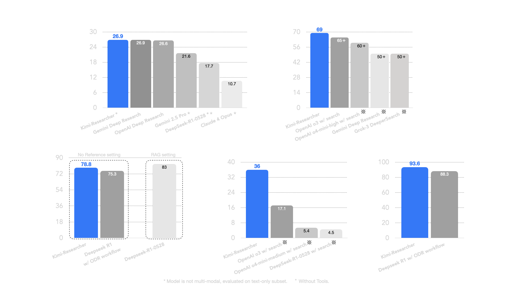
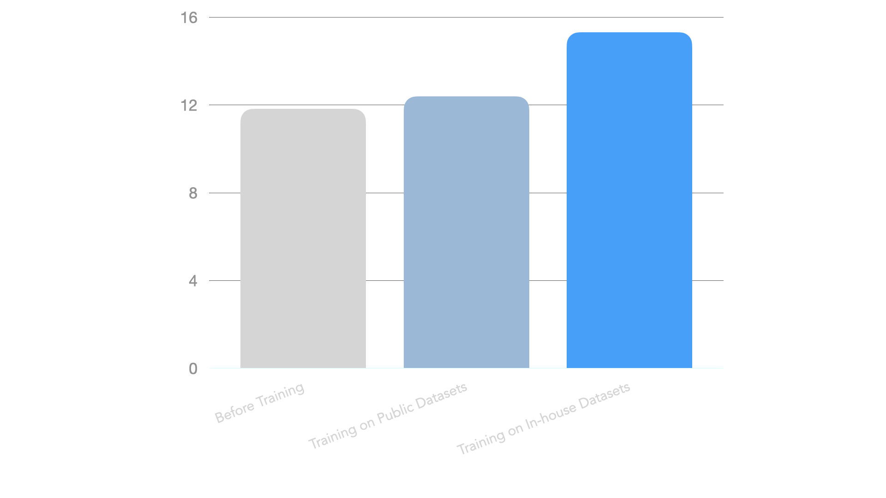
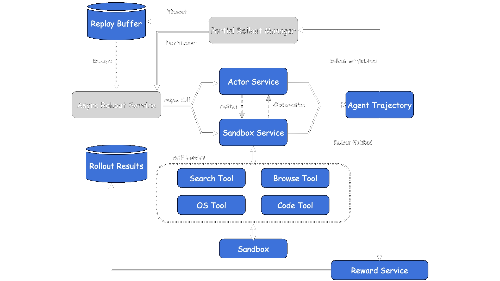

# Kimi-Researcher: End-to-End RL Training for Emerging Agentic Capabilities

原文链接: https://moonshotai.github.io/Kimi-Researcher/

# Kimi-Researcher

## End-to-End RL Training for Emerging Agentic Capabilities

June 20, 2025 • 10 min read

Meet **Kimi-Researcher**, an autonomous agent that excels at multi-turn search and reasoning. It performs an average of 23 reasoning steps and explores over 200 URLs per task. Built on an internal version of the [Kimi k-series model](https://arxiv.org/abs/2501.12599) and trained entirely through end-to-end agentic reinforcement learning (RL), it achieved a Pass@1 score of **26.9%**—a state-of-the-art result—on [Humanity's Last Exam](https://agi.safe.ai/), and Pass@4 accuracy of **40.17%**. Starting from an initial HLE score of 8.6%, Kimi-Researcher reached 26.9% almost entirely through end-to-end RL training, providing compelling evidence that end-to-end agentic RL can significantly advance agent intelligence.

Kimi-Researcher has also achieved strong performance across several complex and challenging real-world benchmarks. On [xbench](https://xbench.org/), a new, dynamic, professionally-aligned suite designed to bridge AI capabilities with real-world productivity, Kimi-Researcher achieved 69% pass@1 (averaged on 4 runs) on xbench-DeepSearch, outperforming models such as o3 with search tools. On benchmark tests for multi-turn search reasoning ([FRAMES](https://arxiv.org/abs/2409.12941), [Seal-0](https://arxiv.org/abs/2506.01062v1)) and factual information ([SimpleQA](https://arxiv.org/abs/2411.04368)), Kimi-Researcher also achieved strong performance.

**Figure 1**

1. Potential fluctuations in tools, such as search engines, may affect performance. The results are tested on: HLE on June 17, 2025; and xbench-DeepSearch, Seal-0, Frames, and SimpleQA on June 18, 2025.
2. All Kimi-Researcher results were evaluated using o3-mini. Scores of other models are referenced from the relevant papers or leaderboards.
   [[1]](https://storage.googleapis.com/deepmind-media/gemini/gemini_v2_5_report.pdf)
   [[2]](https://github.com/deepseek-ai/DeepSeek-R1/blob/main/DeepSeek_R1.pdf)
   [[3]](https://arxiv.org/abs/2503.20201)
   [[4]](https://openai.com/index/introducing-deep-research/)
   [[5]](https://lastexam.ai/)
3. For benchmarks with fewer than 200 test samples (xbench, Seal-0), we performed four runs and reported the average result (avg@4).
4. We do not compare multi-agent workflows based on multiple frontier models here, as our focus is on evaluating model capabilities.

### End-to-end agentic RL is promising but challenging

Kimi-Researcher is an autonomous agentic and thinking model designed to solve complex problems through multi-step planning, reasoning, and tool use. It leverages three main tools: a parallel, real-time internal **search tool**; a text-based **browser tool** for interactive web tasks; and a **coding tool** for automated code execution.

Formally, given the state observation \(s\_t\) (for instance, \(s\_0\) includes system prompt, tool declarations, and user query) , Kimi-Researcher generates \(\text{think}\_t\) and \(\text{action}\_t\). An action can either be a tool call or an indication to terminate the trajectory. The detailed behavior of Kimi-Researcher is as follows:
\begin{cases}
(s\_t) \xrightarrow{\text{Kimi-Researcher}} (\text{think}\_t, \text{action}\_t) \\
s\_{t+1} = \text{context\_manager}(s\_t, \text{think}\_t, \text{tool\_call\_result}\_t) & \text{if } \text{action}\_t \neq \text{finish} \\
\text{terminate} & \text{if } \text{action}\_t = \text{finish}
\end{cases}

Traditional agent development has key limitations:

1. **Workflow-Based Systems:** [Multi-agent workflows](https://www.anthropic.com/engineering/built-multi-agent-research-system) assign roles to specialized agents and coordinate the agents using prompt-based workflows. While effective, they are tied to specific LLM versions and need frequent manual updates as models or environments change, reducing scalability and flexibility.
2. **Imitation Learning with Supervised Finetuning (SFT):** Imitation learning aligns models well with human demonstrations but struggles with data labeling—especially for long-horizon, agentic tasks in dynamic environments. Furthermore, SFT datasets are tightly coupled with specific tool versions, resulting in poor generalization as tools evolve.

End-to-end agentic reinforcement learning trains a single model to solve problems holistically: given a query, the agent explores a large number of possible strategies, receives rewards for correct solutions, and learns from the full trajectory. Unlike SFT, it naturally handles long, on-policy reasoning and adapts to changing tools and environments; unlike modular approaches, all skills—planning, perception, and tool use—are learned together without hand-crafted rules or workflow templates. Previous work like [OpenAI's Deep Research](https://openai.com/index/introducing-deep-research/) also highlights the strong performance of this approach, but it introduces new challenges:

* **Dynamic Environments:**
  Agents must adapt to constantly changing conditions, as even identical queries can yield different results over time. The goal is robust generalization despite distribution shifts.
* **Long-Horizon Tasks:**
  Kimi-Researcher can run 70+ search queries[\*](#note-long-horizon-tasks) per trajectory, with context windows reaching hundreds of thousands of tokens. This demands advanced memory management and long-context models.
* **Data Scarcity:**
  High-quality RL datasets for agentic QA are rare. We address this by automatically synthesizing training data, allowing large-scale learning without manual labeling.
* **Rollout Efficiency:**
  Multi-turn reasoning and heavy tool use can slow training and cause GPU under-utilization. Optimizing rollout efficiency is crucial for scalable, practical agent RL training.
\* calculated based on a small set of queries.

### Approach

Kimi-Researcher is trained via end-to-end reinforcement learning. We observe a consistent improvement in agent performance across different domains. [Figure 2-a](#figure-2-a) illustrates the overall training accuracy of Kimi-Researcher throughout the reinforcement learning process. [Figure 2-b](#figure-2-b) presents model performance on several internal datasets.

**Figure 2-a**

**Figure 2-b**

#### Training data

To address the scarcity of high-quality agentic datasets, we engineered our training corpus with two complementary objectives.

First, we developed a suite of challenging, tool-centric tasks designed to promote robust tool-use learning. These prompts are deliberately constructed such that solving the task requires invoking specific tools—making naive approaches either infeasible or substantially less efficient. By embedding tool dependencies into task design, the agent learns not only when to invoke a tool, but also how to orchestrate tool use effectively in complex, real-world settings. (See [Figure 3](#figure-3) for tool invocation rates using these training data.)

**Figure 3**

**Figure 4**

Second, we curated and synthesized reasoning-intensive tasks to reinforce the agent's core cognitive abilities and its capacity to integrate reasoning with tool usage. This component is further subdivided into:

* **Math and Code Reasoning:** Tasks that target logical inference, algorithmic problem-solving, and sequential computation. Kimi-Researcher learns to solve this kind of problem with our toolset beyond purely using chain-of-thought.
* **Hard Search:** Scenarios where the agent must iteratively search, synthesize, and reason within context constraints to derive valid answers. Case studies illustrate how these hard search tasks drive the emergence of deeper planning and robust, tool-augmented reasoning strategies.

To build this diverse prompt set at scale, we developed a **fully automated pipeline** capable of generating and validating many question-answer pairs with **minimal manual intervention**, ensuring both diversity and correctness at unprecedented scale. **Ensuring accurate ground truth (GT) is critical for synthetic tasks**, so we introduced a robust GT extraction method to guarantee that each question is paired with a reliable answer whenever possible. Additionally, a rigorous filtering funnel removes ambiguous, trivial, or incorrect pairs — with **Pass@N checks ensuring only non-trivial questions are retained**. [Figure 4](#figure-4) shows the effectiveness of our synthetic tasks based on two experimental results.

#### RL training

The model is primarily trained using the [REINFORCE](https://link.springer.com/content/pdf/10.1007/BF00992696.pdf) algorithm. We have observed that the following factors contribute to more stable training:

* **On-policy Training:** It is critical to generate strict on-policy data. During training, we disable LLM engine mechanisms like toolcall format enforcers to ensure each trajectory is generated entirely based on the model's own probability distribution.
* **Negative Sample Control:** Negative samples lead to a decrease in token probabilities, which increases the risk of entropy collapse during RL training. To address this, we discard some negative samples strategically, allowing the model to continue improving over a longer training period.

Kimi-Researcher uses outcome rewards for training, aiming to provide a constant preference in a dynamic training environment.

* **Format Reward:** The model is penalized for trajectories that include invalid tool calls or if the context/iteration exceeds the maximum limitation.
* **Correctness Reward:** For trajectories without format errors, rewards are based on the comparison between the model's answer and the ground truth.

To promote efficiency, a gamma-decay factor is applied to correct trajectories. Concretely, the reward of step \(i\) becomes \(r\times\gamma^{T - i}\), where \(r\) is the outcome reward, \(T\) is the number of steps, and \(0<\gamma<1\) represents the gamma-decay coeficient. This encourages the model to discover shorter, more efficient exploration. For example, while two correct trajectories may receive equal final rewards, the shorter one earns a higher reward for its initial actions.

#### Context management

A long-horizon research trajectory may involve massive observation contexts, and a naive agent without memory management can easily exceed the limitation within 10 iterations. To address this, we design a context-management mechanism that allows the model to retain important information while discarding unnecessary documents, thereby extending a single rollout trajectory to over 50 iterations. An early ablation study shows that a model trained with context management uses **30%** more iterations, which enables it to acquire more information and achieve higher performance.

#### Large-scale agent RL infra

**Figure 5**

To address the efficiency and stability challenges of large-scale Agent RL, we have developed a suite of infrastructure with the following key features:

* **Fully asynchronous rollout:** We implement a fully asynchronous rollout system with extensible Gym-like interfaces. The server-based architecture efficiently orchestrates actor rollouts, environmental interactions, and reward calculations in parallel. This design significantly outperforms its synchronous counterpart by eliminating resource idle time.
* **Turn-level partial rollout:** During Agent RL, while the majority of tasks completed at the early stage, a small fraction required extensive turns. To solve this long-tail problem, we designed a Turn-level Partial Rollout mechanism. Concretely, tasks that exceed a time budget would be saved to a replay buffer. In subsequent iterations, the remaining turns would be executed with updated model weights. Combined with adapted algorithms, this mechanism delivers substantial rollout acceleration (at least 1.5x).
* **Robust sandbox environment:** Our unified sandbox architecture eliminates inter-container overhead while maintaining isolation. Zero-downtime scheduling with Kubernetes-based hybrid cloud architecture enables dynamic resource allocation. Agent-tool communication via Model Context Protocol (MCP) maintains stateful sessions with reconnection capabilities. Our implementation supports multi-replica deployment, ensuring fault-tolerant operation and high availability in production environments.

### Emerging agentic capacities

During end-to-end reinforcement learning, we observed several notable emergent abilities in Kimi-Researcher. Here are two highlights:

* When presented with conflicting information from multiple sources, Kimi-Researcher resolves inconsistencies through iterative hypothesis refinement and self-correction.
"Strange Stories from a Chinese Studio" is a collection of classical Chinese short stories written by the Qing Dynasty novelist Pu Songling. The earliest manuscript copies were already in circulation during the Kangxi reign of the Qing Dynasty, and the collection comprises over four hundred short stories in total. In Volume Ten of "Strange Stories from a Chinese Studio," there is a story titled "The Green-Clothed Girl." In this story, \*\*how many sentences did the scholar Yu Jing speak with her?\*\*

...Now I will use the search tool.
...Numbers [^5^] and [^6^] are \*\*vernacular translations from Himalaya\*\*...In addition, numbers [^16^] and [^17^] are \*\*the original texts\*\*, I need to cross-reference them again...The dialogue between Yu Jing and the woman in green may have different records in \*\*different versions\*\*...
...I counted carefully, and in the vernacular translation of number [^5^], Yu Jing seems to have said \*\*six sentences\*\*. But in the original texts of numbers [^16^], [^44^], [^48^], etc., counting them up, Yu Jing said \*\*four sentences\*\*...Well, according to my previous compilation, numbers [^68^], [^88^], [^89^], [^90^], etc. all provide the original text of "The Woman in Green"...So, Yu Jing said a total of four sentences. Previously, when I counted six sentences in the translation of number [^5^], it may be because the translation converted some narrative sentences into direct quotations...
...Considering that in classical Chinese, these direct quotations are explicit, while if the translation added some dialogue, it may have been embellishment done for ease of understanding...
...After careful verification, the words Yu Jing directly said in the original text are: 1. "Your voice is delicate and soft, if you were to sing a song, it would surely be soul-stirring." 2. "Why are you so deeply suspicious and fearful?" 3. "A stirring heart and wandering eyes are common occurrences, why do you say such things?" 4. "Yes." Therefore, Yu Jing spoke a total of four sentences in the story. \*\*Previously, in the translation of number [^5^], I mistakenly took some narrative sentences as dialogue, leading to a miscount. After confirmation, the original classical Chinese text is authoritative and has been verified multiple times.\*\* It seems that in "The Woman in Green," Yu Jing indeed said four sentences. I think I can answer this question now.
Answer: \*\*4\*\*
In "The Woman in Green" from Volume 10 of "Strange Tales from a Chinese Studio," the scholar Yu Jing spoke a total of \*\*4\*\* sentences.

* Kimi-Researcher demonstrates caution and rigor: even for seemingly straightforward questions, it deliberately performs additional searches and cross-validates information before answering.
A country located in South America, where the most popular sport is baseball, not football. Football is relatively less popular in this country, which has never qualified for the FIFA World Cup finals but has hosted the Copa América. In terms of football, the country has had a star player who once played in the Bundesliga. Who might that be?

...From the previous search results, I can infer: This South American country is \*\*Venezuela\*\*. Its most popular sport is baseball. It has never entered the World Cup finals. It hosted the Copa América (2007). Football star \*\*Juan Arango\*\* once played for Borussia Mönchengladbach in the Bundesliga.
To confirm whether Juan Arango is a Venezuelan football star who once played in the Bundesliga, I...
...To further confirm, I want to search for more information about Juan Arango to verify...
...I previously assumed it was Venezuela, but need further verification...
...To further confirm the accuracy of the information...need to re-verify.
...Additionally, I also need to search for other players who might fit, perhaps whether Venezuelan players like Caracas, Torres, Maldonado, etc. have ever played in the Bundesliga...covering information in both Chinese and English to improve the comprehensiveness of the search.
...According to the information from references [^62^] and [^66^]...this information all supports that \*\*Juan Fernando Arango\*\* is Venezuela's star player in football who once played in the Bundesliga.
Combined with the previous search results...
To obtain more official and authoritative information for further confirmation, I decided to call up the complete content of reference [^62^]...I now feel that I have collected enough information to answer this question completely.
Answer: \*\*Juan Fernando Arango\*\*

### Use cases

Academic research
Legal & regulatory insights
Obscure information retrieval
Clinical evidence review
Corporate financial analysis

### What's next

Kimi-Researcher is beginning its gradual rollout to users today. It empowers you to conduct deep, comprehensive research on any topic directly within [Kimi](https://www.kimi.com/). Join the waitlist [here](https://forms.gle/CRcZGWKAoYNsMjad8).

It represents the early stage of our broader vision: evolving from a focused search and reasoning agent into a general-purpose agent capable of solving a wide range of complex tasks with an ever-expanding toolkit. To realize this vision, we are expanding the agent's capabilities across both tools and task domains, while also advancing the underlying reinforcement learning infrastructure and algorithms to ensure greater training stability and efficiency.

To facilitate more research efforts in the field, we are planning on open-sourcing the base pretrained model as well as the reinforcement-learned model underlying Kimi-Researcher in the following months.

TOC

**Table of Contents**

* [Kimi-Researcher](#banner)
* [End-to-end agentic RL is promising but challenging](#end-to-end-agentic-rl-is-promising-but-challenging)
* [Approach](#approach)
  + [Training data](#training-data)
  + [RL training](#rl-training)
  + [Context management](#context-management)
  + [Large-scale agent RL infra](#large-scale-agent-rl-infra)
* [Emerging agentic capacities](#emerging-agentic-capacities)
* [Use cases](#use-case)
* [What's next](#whats-next)

